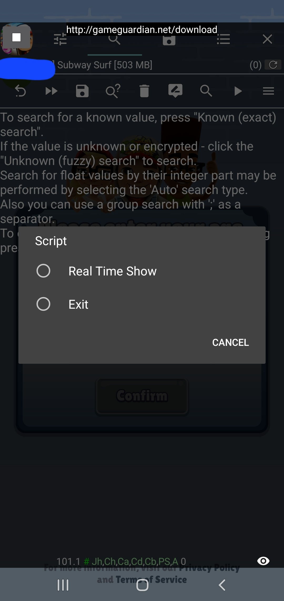
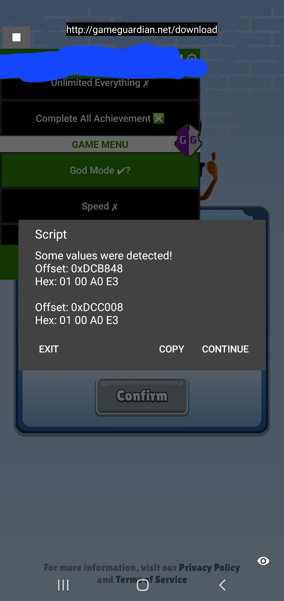

# Parsast Hex Founder

Parsast Hex Founder is a Game Guardian Lua script designed for Android mod menus. It helps users identify offsets and hexadecimal values in memory regions of Android applications. This script leverages a vulnerability identified by MemoryPatch to streamline the process of memory patching and modding.

## Features

- **Library Selection**: Scans and selects libraries within the target application, filtering out unwanted libraries.
- **Real-Time Value Detection**: Monitors memory values in real-time and detects changes.
- **Accurate Offset Calculation**: Computes offsets relative to the selected library, ensuring accurate results.
- **User-Friendly Interface**: Provides a clear interface for users to interact with, allowing them to save results, continue scanning, or exit the application.

## How to Use

1. Launch the script in Game Guardian.
2. Select the library you wish to analyze from the list.
3. The tool will automatically start detecting changes in the memory values of the selected library.
4. When changes are detected, offsets and corresponding hex values will be displayed.
5. Choose to either save the results, continue scanning, or exit the application.

## Screenshots

Here are some screenshots showcasing the functionality of the script:

### Script Interface

### Library Selection

### Detected Values

### Save or Exit Options

> **⚠ DISCLAIMER**
> The owner is not responsible for any damage caused by using this tool. This project is made for educational purposes only. Use it at your own risk. If you encounter any issues or have questions, please let us know.

---

Feel free to contribute or reach out if you have any ideas to improve the project!
